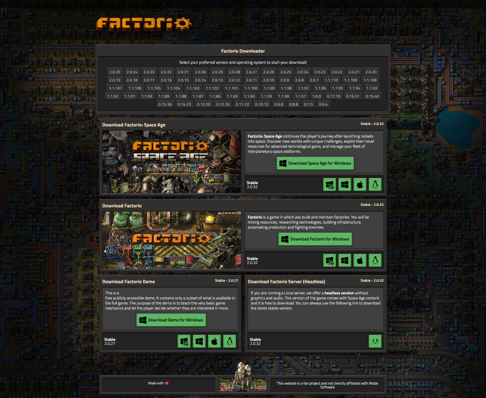

# Factorio Downloader

**Factorio Downloader** is a self-hosted web application for downloading Factorio builds — the full game, the free demo, the headless server, and the Space Age expansion — filtered by version and operating system.

It is a **personal-use tool, not a piracy vector**: every download for the full game and the Space Age expansion is authenticated against your own Factorio account through the official API. If your account doesn't own the game (or the DLC), the download simply doesn't happen. Your credentials are never shared with, or visible to, anyone but your own server.

> **Security notice.** Configure your own Factorio account credentials before use (see [Setup](#setup)). Downloads for the full game and Space Age are gated by account ownership — this project does not, and cannot, bypass that.

---

## Table of Contents

- [Features](#features)
- [How It Works](#how-it-works)
- [Requirements](#requirements)
- [Deployment](#deployment)
- [Setup](#setup)
- [Keeping Your Server Protected](#keeping-your-server-protected)
- [Usage](#usage)
- [Automatic Version Updates](#automatic-version-updates)
- [Project Structure](#project-structure)
- [Contributing](#contributing)
- [License](#license)
- [Acknowledgments](#acknowledgments)
- [Screenshot](#screenshot)

---

## Features

- **Full version history** — every Factorio release back to `0.6.4`, always current, with no manual maintenance (see [Automatic Version Updates](#automatic-version-updates)).
- **Four download categories** — Full Game, Demo, Headless Server (Linux only), and the Space Age expansion.
- **Stable vs. Experimental at a glance** — the version picker mirrors the official site: stable releases in white, experimental-only builds dimmed.
- **Automatic OS detection** — the right download button (Windows, macOS, or Linux) is highlighted for you.
- **Account-gated downloads** — Full Game and Space Age downloads authenticate against the official [Factorio Web authentication API](https://wiki.factorio.com/Web_authentication_API); they only proceed if your account owns the content.
- **Direct redirection, no proxying** — your browser is redirected straight to Factorio's own servers; this app never streams game files itself.
- **One-time, guided setup** — a built-in web installer (`setup.php`) collects and verifies your credentials once, then locks itself down permanently.

---

## How It Works

```
GitHub Action (daily)  ──▶  versions.json  ──▶  your server (cached fetch, no redeploy needed)
                                                        │
you, once  ──▶  setup.php  ──▶  .env (credentials)      │
                                                        ▼
                                              index.php / download.php
                                                        │
                                          authenticates with Factorio's API,
                                          redirects your browser to the real download
```

- **Version data** lives in `versions.json` and is refreshed daily by a GitHub Action that reads Factorio's own release APIs. Your deployed site pulls the latest copy automatically — no redeploy required when a new version ships.
- **Credentials** live only in your server's `.env` file, created once through `setup.php` and never committed to git or exposed over HTTP.
- **Downloads** are never proxied through your server: it asks Factorio for the real, signed download URL and redirects your browser to it directly.

---

## Requirements

- PHP 8.2+ with the `curl` extension.
- Apache (with `.htaccess` support) or nginx, or Docker.
- A Factorio account that owns the content you want to download (and the Space Age DLC, if applicable).
- No Composer/Node build step is required — the app runs out of the box on a plain host.

---

## Deployment

1. **Get the code onto your server.**

   - **Git (recommended, e.g. cPanel's Git Version Control):**
     ```bash
     git clone https://github.com/factoriocenter/factorio-downloader.git
     ```
   - **Docker:** build the included `Dockerfile` (Apache + PHP, pre-configured with the security hardening described below).
   - **Manual upload:** copy all files to your PHP-enabled host via FTP/File Manager.

2. **Point your web server at the project root** (`index.php` is the entry point).

3. **Run the setup** — see the next section. This is the only manual step; everything else (versions, redirects, protection) is automatic.

---

## Setup

The **only** thing you need to configure by hand is your Factorio account credentials. Everything else — fetching your auth token, keeping `.env` safe, keeping the version list current — is handled automatically.

### Guided setup (recommended)

Open `https://your-domain/setup.php` in your browser:

1. Enter your Factorio login and password. (Some accounts require a one-time e-mail code — the form asks for it automatically if needed.)
2. `setup.php` verifies your credentials against the official Factorio API, obtains a token, and writes a `.env` file for you — nothing to copy, no manual token lookup.
3. **Delete `setup.php` from the server** once you see the success page. It has already locked itself, but removing the file is good hygiene.

That's it — no command-line tools, no `cURL` invocations, no separate "get my token" script to run.

### The one-time lock, guaranteed

`setup.php` is designed to run **exactly once**, and that guarantee holds under any kind of request, not just normal use through a browser:

- The very first thing the script does, before anything else runs, is check whether `.env` already exists. If it does, every request — `GET`, `POST`, or anything else — gets an immediate `403` and the form is never shown, never processed.
- The check-then-write sequence is protected by an exclusive file lock, so even two requests arriving at the exact same instant can't both slip through before either one finishes writing `.env`.
- `.env` is the **only** file `setup.php` ever writes, and `setup.php` is the **only** file in the entire codebase that ever writes to `.env`. There is no other endpoint, parameter, or code path anywhere in the project that can create, modify, or delete it.

In short: once `.env` exists, the installer is permanently inert — no request, race condition, or retry can change that. To reconfigure, you must delete `.env` from the server yourself.

### Manual setup (alternative)

If you'd rather not expose `setup.php` at all, copy `.env.example` to `.env` and fill it in directly:

```dotenv
FACTORIO_LOGIN=your_login
FACTORIO_PASSWORD=your_password
# Optional: a pre-obtained token, used instead of authenticating on every request.
FACTORIO_TOKEN_FALLBACK=your_fallback_token
```

`download.php` authenticates on demand using `FACTORIO_LOGIN`/`FACTORIO_PASSWORD` if no fallback token is set (or if the token has expired), so `FACTORIO_TOKEN_FALLBACK` is an optional performance shortcut, not a requirement.

> **TLS note:** authentication verifies Factorio's certificate against your system's CA
> trust store — no CA bundle is ever downloaded at runtime. If your PHP has a broken
> `curl.cainfo` and you see a "TLS certificate verification failed" message, point the
> optional `FACTORIO_CA_BUNDLE` environment variable at a trusted `cacert.pem`, or fix
> `curl.cainfo` in `php.ini`.

---

## Keeping Your Server Protected

`.env` lives in the web root, so it must never be downloadable over HTTP — and neither should `.git`, if your host clones the repository directly into the site's public folder.

- **Apache / cPanel:** the bundled **`.htaccess`** denies access to `.env`, every dotfile
  (including a `.git` directory sitting in the web root), directory listing, and the
  `lib/`, `scripts/`, `tests/`, `docs/`, `vendor/`, `certs/`, `site/` folders — plus
  baseline security headers (`X-Content-Type-Options`, `X-Frame-Options`,
  `Referrer-Policy`) for the whole site.
- **nginx:** copy **`deploy/nginx.conf.example`** into your server config — it mirrors
  the same protections and forces HTTPS.
- **Docker:** the `Dockerfile` enables `mod_headers` and sets `AllowOverride All` (the
  base image ships with `AllowOverride None`, which would otherwise make `.htaccess`
  silently inert), and a **`.dockerignore`** keeps `.git`, `.env`, and other local-only
  files out of the built image entirely.

**After deploying, verify it:** `https://your-domain/.env` and `https://your-domain/.git/config` should both return **403/404**.

---

## Usage

1. **Browse versions.** The homepage lists every available Factorio version. Click one to filter the download sections to it.
2. **Pick a category.** Full Game, Demo, Server, and Space Age sections appear as relevant to the selected version.
3. **Download.** Clicking a download button authenticates (if needed) and redirects your browser straight to Factorio's own servers — nothing is proxied through this app.

The Headless Server build is Linux-only, matching Factorio's own distribution.

---

## Automatic Version Updates

Version data is **not maintained by hand**. It lives in `versions.json`, split by distribution (base game, demo, headless server, Space Age) and channel (`stable` / `experimental`):

```json
{
  "factorio": { "stable": ["..."], "experimental": ["2.1.9"] },
  "demo":     { "stable": ["..."], "experimental": ["..."] },
  "server":   { "stable": ["..."], "experimental": ["..."] },
  "spaceage": { "stable": ["..."], "experimental": ["..."] },
  "all":      ["2.1.9", "...", "0.6.4"]
}
```

**A daily GitHub Action** (`.github/workflows/update-versions.yml`, 08:00 BRT / 11:00 UTC) reads two official Factorio APIs — [`latest-releases`](https://factorio.com/api/latest-releases) and [`get-available-versions`](https://updater.factorio.com/get-available-versions) — and commits `versions.json` only when something actually changed: a new experimental release, or an experimental build promoted to stable. No version already known is ever dropped. Run it yourself with:

```bash
php scripts/update-versions.php
```

**Your deployed site never needs a redeploy for this.** `config.php` fetches the latest `versions.json` straight from GitHub and caches it locally (default: 1 hour), falling back to the last good cache and then to the committed file if the fetch ever fails. Tunable via environment variables:

| Variable | Purpose |
|---|---|
| `FACTORIO_VERSIONS_URL` | Override the source URL. |
| `FACTORIO_VERSIONS_TTL` | Cache lifetime in seconds (default `3600`). |
| `FACTORIO_VERSIONS_REMOTE=0` | Disable the remote fetch; use only the local file. |

**Optional: keep the code itself in sync too.** The runtime fetch above only refreshes the version *list*. If you also want the application *code* to update automatically when you push to GitHub, add `scripts/cpanel-pull.sh` as an hourly cron job:

```
0 * * * *  /bin/bash /home/USER/public_html/facdl/scripts/cpanel-pull.sh >> "$HOME/facdl-pull.log" 2>&1
```

It fast-forwards the deployed clone (`git merge --ff-only`) — it never deletes untracked files (`.env`, `vendor/`, `certs/`) and never overwrites local changes; if it can't fast-forward cleanly, it does nothing and logs why.

---

## Project Structure

```
factorio-downloader/
├─ index.php                # Entry point
├─ theme.php                # Version selection, filtering, Stable/Experimental labeling
├─ download.php              # Authenticates and redirects to the official download URL
├─ setup.php                # One-time web installer that creates .env
├─ config.php                # Loads .env and versions.json (with live GitHub fetch + cache)
├─ strings.php               # UI copy
├─ versions.json             # Version data (auto-updated, do not edit by hand)
├─ .env.example              # Template for manual .env setup
├─ .htaccess                 # Apache: blocks .env, .git, and internal folders
├─ .dockerignore             # Keeps .git/.env out of Docker images
├─ Dockerfile                # Apache + PHP container, pre-hardened
├─ lib/
│   └─ factorio-auth.php      # Shared Factorio Web authentication API client
├─ scripts/
│   ├─ update-versions.php    # Refreshes versions.json from Factorio's official APIs
│   └─ cpanel-pull.sh         # Optional cron helper to auto-pull code updates
├─ deploy/
│   └─ nginx.conf.example     # nginx equivalent of the .htaccess protections
├─ tests/
│   └─ update-versions-test.php
├─ .github/workflows/
│   └─ update-versions.yml    # Daily GitHub Action
└─ site/
    ├─ downloadFactorio.php   # Full Game section
    ├─ downloadDemo.php       # Demo section
    ├─ downloadServer.php     # Headless Server section
    ├─ downloadSpaceAge.php   # Space Age section
    ├─ gameVersions.php       # Version picker
    ├─ header.php             # <head>, styles, scripts
    ├─ menu.php               # Top navigation
    └─ footer.php             # Footer
```

---

## Contributing

Contributions are welcome. Please open an issue or a pull request on the [GitHub repository](https://github.com/factoriocenter/factorio-downloader).

---

## License

This is a fan project, not affiliated with Wube Software. Use it at your own risk, and make sure your use complies with Factorio's own terms and applicable law.

---

## Acknowledgments

- The Factorio community, for inspiration and prior art in this space.
- The maintainers of PHP, cURL, and `vlucas/phpdotenv`.
- Built with the help of AI coding assistants.

---

## Screenshot


